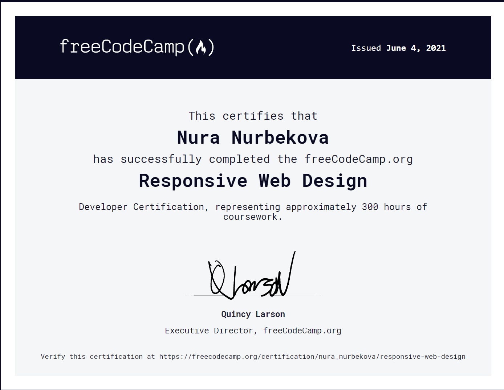
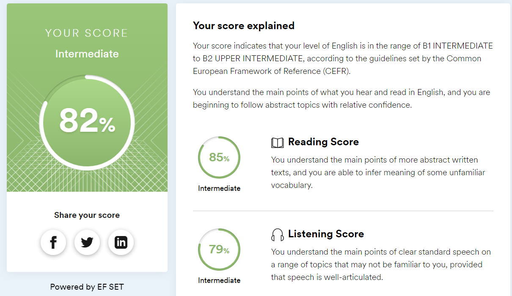

# Nura Nurbekova

## Contact Information
* **Telegram:** [@nura_nurbekova](https://t.me/nura_nurbekova)
* **Discord:** nuranurbekova
* **E-mail:** nura.nurbekova.kk@gmail.com
* [LinkedIn](linkedin.com/in/нура-нурбекова-12757b222)

## About me
I am an accountant with 5 years of experience. I’m taking online courses to become a Web Developer. I’m punctual and responsible person.

## Skills
* HTML
* CSS / SASS / Bootstrap
* Git /GitHub
* Figma

## Code Examples
``` 
function multiply(a, b){
    return (a * b)
}
```

## Courses
* CDAC, Noida Basic IT "Fundamental and Applications"
* Html, CSS and Javascript [ru-code-basics](https://ru.code-basics.com/) (CSS and JS in process)
* Responsive Web Design [FreeCodeCamp](https://www.freecodecamp.org/)


## Languages
* Kyrgyz - Native
* Russian - Fluent
* Turkish - Intermediate
* English - Intermediate [EFSET](https://www.efset.org/quick-check/)


